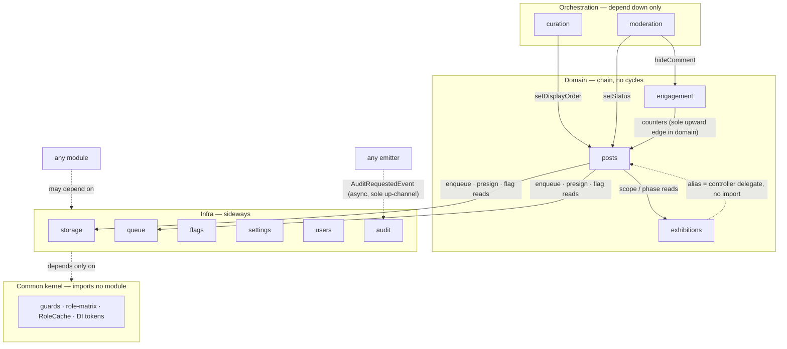

---
aliases:
  - ADR-005
tags:
  - declic
  - adr
status: accepted
updated: 2026-09-07
---
# ADR-005: Modular Monolith Boundaries for `apps/api`

**Status:** Accepted
**Date:** 2026-09-07
**Org:** bal16
**Deciders:** repo owner
**Related:** [PRD-API](../specs/PRD-API.md) §1–§2/§4, [PRD-Worker](../specs/PRD-Worker.md) §1–§3, [db-schema](../data/db-schema.md), `../data/seed.ts`, `../../apps/api/src/app.module.ts`, `../../apps/api/src/modules/examples/`, [ADR-001](./ADR-001-monorepo-mirror.md), [ADR-003](./ADR-003-zod-dto-strategy.md)

---

## 1. Context

`apps/api` is a single NestJS deployable ([ADR-001](./ADR-001-monorepo-mirror.md)) with 12 planned
feature modules ([PRD-API](../specs/PRD-API.md) §1.1: auth, users, exhibitions,
posts/photo-items, curation, moderation, engagement, storage, queue,
feature-flags, site-settings, audit) plus `common/`. Today only
`app.module.ts` (global config + health) and the `modules/examples/`
living skeleton exist; `packages/db` has no `src/` yet and no
event-emitter dependency is installed.

Without boundary rules the module list is a plain monolith: any module
can deep-import any other module's internals or write to any table,
and the codebase drifts into spaghetti before 1.0. The team is one
person, one Postgres, one Redis — microservices would add ops cost
with no scaling benefit pre-launch. What is needed is a structure
that keeps one deployable but preserves extractability later.

Q1 scope for 1.0 is confirmed IN: photographer withdraw
(`DELETE /api/posts/:id`, soft-delete), exhibition poster upload
(`POST /api/admin/exhibitions/:id/poster-upload-url` + `poster_s3_key`
via existing PATCH), and curator revert
(`POST /api/admin/posts/:postId/frames/:itemId/revert`). All three fit inside
the module boundaries defined here with no new tables.

## 2. Decision

`apps/api` is a **modular monolith**: one deployable, hard module
boundaries, extractable later.

### Rule 1 — No deep cross-module imports

Each module exposes exactly one entry point, `public-api.ts`
(facade service + events it emits). Any file not re-exported from
`public-api.ts` is internal and off-limits to other modules.
`common/` (guards, interceptors, filters, decorators) is the only
code importable from anywhere.

Enforcement: `scripts/check-boundaries.ts` CI gate (same pattern as
`scripts/check-coverage.ts`), failing on imports matching
`modules/<other-module>/*` except via `public-api`. Wired into
`ci.yml` verify and `release.yml` verify as the `boundaries` step
(coverage stays a release-only gate — `ci.yml` has none).

### Rule 2 — Table ownership (one writer per table)

| Module | Owns (sole writer) |
|---|---|
| `exhibitions` | `exhibitions` |
| `posts` | `posts`, `photo_items`, `photo_derivatives` |
| `engagement` | `likes`, `comments` (plus `posts.likes_count`/`comments_count` in its own tx) |
| `feature-flags` | `feature_flags` |
| `site-settings` | `site_settings` |
| `audit` | `admin_audit_logs` (append-only; others request **only** via `AuditRequestedEvent`, never direct inserts) |
| `curation` / `moderation` | **no tables** — operate on `posts` only through the `posts` facade (`setDisplayOrder`, `setStatus`), never raw Drizzle writes |
| `storage` / `queue` | no tables — MinIO presign / BullMQ enqueue facades |
| `auth` / `users` | Better Auth-owned tables + `users.role` elevation |

`packages/db` (Drizzle schema, seeded from `docs/seed.ts`) is shared
readable schema; **writes** follow the ownership map.

### Rule 3 — Sync by default, events for fire-and-forget audit only

CRUD flows go through facades synchronously: enqueue via the `queue`
facade, freeze via `ExhibitionPhaseGuard`, `PENDING` promotion via the
worker callback writing through `posts`. In-memory events are not
durable — a crash between emit and handle loses the event without a
trace — and a freeze must be immediate, not eventual. So the only
cross-module event is audit:

| Event | Emitter | Listener | Effect |
|---|---|---|---|
| `AuditRequestedEvent { action, adminId, targetId, payload }` | any module (moderation, curation, exhibitions cron, users, flags/settings) | `audit` | append one `admin_audit_logs` row, best-effort |

One generic event (not per-action classes): all 9 audit actions share
the same no-retry behavior, so per-action classes would be boilerplate
with no behavioral difference; adding an action never changes the contract.

**Failure semantics (best-effort + visibility):** the request succeeds
first; the listener writes behind it. A listener failure is Pino-logged
plus metered and never fails the request. Rationale: for an exhibition
admin trail the work state is critical and its note is not — reversing
that priority (failing a valid approve over a trail write) is worse
than a losable row. Durable outbox is post-1.0.

Retired from the original 5-event catalog (all re-expressed as facade
calls): `PostCreatedEvent`, `FrameReadyEvent` (fictitious self-loop —
the worker writes through `posts` directly and cannot emit into api
modules), `ExhibitionArchivedEvent`, `PhotoItemReplaced/RevertedEvent`.

Payloads use cuid2 `text` ids; `users` ids stay Better Auth-managed;
`adminId` is `NULL` for cron (`via: "cron"` in payload).

### Rule 4 — Shared kernel only

`packages/contracts` (pure Zod DTOs, [ADR-003](./ADR-003-zod-dto-strategy.md)) + `packages/db`
(schema) + `common/` are the only shared code. DTO wrappers stay
one line each co-located with their module (`*.dto.ts` via
`createZodDto`).

### Rule 5 — Module template + sequencing

Each module ships `*.module.ts`, `public-api.ts`,
`*.controller.ts`, `*.service.ts`, `dto.ts`, `*.test.ts` —
mirroring `modules/examples/`, which is deleted when the first real
module lands (its header already says so).

Landing order: `packages/db` schema first (unblocks all), then
`storage` + `queue` facades, then `posts`, then
`engagement`/`curation`/`moderation` (incl. Q1 withdraw/revert),
then `exhibitions` + poster upload + scheduler, then
`feature-flags`/`site-settings`/`audit`. The worker consumes the
queue payload only — it never imports api modules.

## 3. Alternatives considered

### A. Plain monolith with free imports (status quo) — rejected

Keep the §1.1 module list as convention only, no enforcement.

* Pros: zero tooling, fastest first module.
* Cons: boundaries erode before 1.0; `curation` writing `posts`
  directly and `engagement` reaching into `exhibitions` become
  untestable knots; later extraction requires a rewrite, not a cut.

### B. Microservices per domain — rejected

Split posts/engagement/moderation into separate deployables now.

* Pros: independent deploys, strongest isolation.
* Cons: one-person team pays service-discovery, distributed-tx,
  and multi-repo coordination tax (the exact cost [ADR-001](./ADR-001-monorepo-mirror.md) rejected);
  single Postgres/Redis means distribution without independence.
  Revisit only if a module gets its own team or load profile —
  Rule 1–3 boundaries make that cut mechanical.

### C. This ADR (modular monolith) — accepted

One deployable, enforced boundaries, facade-sync CRUD with an
audit-only event seam. Keeps Bun/NestJS
DX and [ADR-001](./ADR-001-monorepo-mirror.md) release flow (`vX.Y.Z` single tag) unchanged while
preserving a later split path.

## 4. Consequences

* Positive: cross-module changes are explicit (facade or event);
  Q1 features (withdraw soft-delete, poster upload, revert) land
  without new tables; worker stays decoupled via queue payload.
* Negative: new dependency (`@nestjs/event-emitter`); facade
  discipline slows the first module slightly; boundary-check
  script needs maintenance as modules land.
* Guardrails required: `check-boundaries.ts` in CI; code review
  rejects deep imports even when the gate is bypassed; events
  catalog kept in this ADR (table in §2, Rule 3).

## 5. Verification

* `bun run --filter "@declic/api" typecheck` clean with
  `@nestjs/event-emitter` installed.
* `bun run boundaries` green on the tree (only
  `examples/` + `common/` + `*.test.ts` cross-imports allowed until real
  modules land).
* Unit test per module covers facade contract; one integration
  test traces `POST /api/posts` → queued jobs → worker frames →
  `PENDING` without importing internals across modules, plus one test
  proving a failed audit listener never fails the request.
* `bun run coverage` stays ≥90% lines per app ([ADR-002](./ADR-002-release-tagging.md) gate).

## 6. Addendum — layered boundary gate (2026-09-08)

Agreed via grilling: benchmark `check-boundaries.ts` at `0.05s`
(measured, equivalent to oxlint) invalidates the "pre-commit is slow"
assumption, so the gate runs at every layer. `ci.yml` auto-trigger
stays deferred (planning/docs still churn on `main`).

* **Local:** `bun run boundaries` (`package.json` script over
  `scripts/check-boundaries.ts`) + Lefthook pre-commit (full-tree scan,
  no `stage_fixed` — the gate re-stages nothing).
* **Release:** `release.yml` job `verify` runs the boundary step between
  `Lint` and `Format check` (never trusts `main`'s status).
* **Script scope:** Rule A covers relative (`./`, `../`) and alias
  (`@/`, `~/`, `src/`) specs; Rule B forbids
  `apps/worker/src` → `apps/api/src` (worker consumes queue payload
  only; shared code via `packages/contracts`, `packages/db`).
  Allowlist: `common/`, `packages/*` / `@declic/*`, bare imports,
  `*.test.ts`, `modules/examples/`.

## 7. Addendum — inter-module contracts (2026-09-09)

`public-api.ts` (Rule 1) says *through which door* modules call each
other. This addendum closes the five gaps found in the 2026-09-09
contract audit: direction, DI mechanics, validation scope, method
names, and contract tests. Rule status: **accepted** (owner decision).

### 7.1 Layering — depend down only, machine-checkable

Rules:

* **Orchestration** (`curation`, `moderation`) depends **down only**.
* **Domain** is a chain: `engagement → posts → exhibitions`.
  The single upward edge *inside* domain is `engagement → posts`
  counters (Rule 2 ownership exception) — recorded, not repeatable.
* **Infra** (`storage`, `queue`, `flags`, `settings`, `users`,
  `audit`) is sideways: anyone may depend on it; it depends only on
  `common/`.
* **`common/` imports no feature module, ever.** Guard needs are met
  by dependency inversion: `common/` defines the token, the feature
  module provides it.
* **Cycle resolutions** (all five audit risks, closed):
  1. `posts ↔ exhibitions` — the `:id/posts` alias is a
     controller-level delegate, never a module import.
  2. `posts ↔ audit` — reads go through the `audit` facade
     (§7.4: `findLatestUnrevertedReplace`, `search`), never raw table
     reads from other modules.
  3. `users ↔ common` — `RoleCache` lives in `common/`; `users`
     imports it for invalidation. One direction only.
  4. `engagement → posts → moderation → engagement` — impossible by
     layering: `engagement` never imports orchestration.
  5. Scheduler ownership — the cron lives in the `exhibitions`
     module and registers through `queue` infra (`exhibitions →
     queue` is a legal down-to-sideways edge; `queue` never imports
     `exhibitions`).
* The layer map is designed for `check-boundaries.ts` to enforce
  mechanically (direction check on top of the entry-point check) —
  follow-up, not this addendum.

### 7.2 DI mechanics — facades are concrete, not types

Interfaces erase at runtime, so a facade is always a concrete
`@Injectable()` class:

* Provider module `exports:` the facade; consumer module `imports:`
  the provider module; `public-api.ts` is the barrel re-exporting the
  facade class + its input/output types (which come from
  `@declic/contracts` wherever a cross-app shape is involved).
* `common/` tokens (e.g. role resolution) are defined in `common/`,
  provided by the feature module — never the reverse import.

### 7.3 Validation scope — trust inside, parse at 3 cross-process points

* **Inside one process** (facade → facade): trust the types. No Zod
  parse per method — the HTTP pipe (`ZodValidationPipe`) plus
  contract tests (§7.5) already guarantee shapes.
* **`parse` is mandatory at exactly 3 points**, where data is born
  outside the process:
  1. **Queue consume (worker)** — `imageProcessingJobSchema`
     ([contracts](../specs/contracts.md) §3), shared with the producer.
  2. **Cron scheduler** — phase-enum guard on rows acted upon.
  3. **Audit listener** — `AuditRequestedEvent` envelope schema.

### 7.4 Facade method registry

Existing names stand; `*` = proposed here (spec-first, code later).
Signatures abbreviated — full shapes in feature files + [contracts](../specs/contracts.md).

| Caller → Callee | Method | Status |
|---|---|---|
| `curation` → `posts` | `setDisplayOrder(postId, prevDisplayOrder, nextDisplayOrder)` | specified |
| `moderation` → `posts` | `setStatus(postId, action, rejectionReason?)` | specified |
| `moderation` → `engagement` | `hideComment(commentId)` | specified |
| `posts` → `queue` | `enqueueImageJob(payload)` / `cancelJobsForPost(postId)` * | proposed |
| `posts` → `storage` | `presignPut(input)` * | proposed |
| `*` → `flags` | `getFlag(key)` (cached map underneath) * | proposed, replaces stale `SystemService` name |
| `*` → `settings` | `getMaxSeriesSize()` * | proposed |
| `*` → `exhibitions` | `getPhase(id)`, `resolveLatest(kind)` * | proposed |
| `*` → `users` | `RoleCache.get/invalidate` via `common/` | specified |
| `*` → `audit` (read) | `findLatestUnrevertedReplace(itemId)`, `search(filters)` * | proposed |
| `auth` | `validateSession()` (used by `SessionGuard`) * | proposed |
| `*` → `common` | `ROLE_MATRIX` const | specified |
| worker → `posts` | direct DB via `packages/db` (promotion SQL in [PRD-Worker](../specs/PRD-Worker.md) §3.3 — no facade, no HTTP, no import) | specified mechanism |
| cron → `exhibitions` | `archiveOverdue()` (cron goes through the facade, never direct `db.update`) * | proposed |

### 7.5 Contract tests — `contract` block in co-located `*.test.ts`

No new file convention. Each `public-api` method gets a
`describe('contract', …)` block in its module's co-located test file
asserting inputs, outputs, and documented errors from the feature
spec (e.g. `hideComment` idempotency + count rule; `enqueue` payload
shape vs. [contracts](../specs/contracts.md) §3; `getFlag` invalidation).
The generic ADR-005 verification (facade contract per module +
`POST → queue → worker → PENDING` trace + audit-never-fails test)
stays; this makes it enumerable.

---

## Cross references

* Module list + responsibilities: [PRD-API](../specs/PRD-API.md) §1.1
* Schema + ownership targets: [db-schema](../data/db-schema.md), `../data/seed.ts`
* Queue payload + worker contract: [PRD-Worker](../specs/PRD-Worker.md) §1–§3
* DTO strategy for `dto.ts` files: [ADR-003](./ADR-003-zod-dto-strategy.md)
* Repo/release context: [ADR-001](./ADR-001-monorepo-mirror.md), [ADR-002](./ADR-002-release-tagging.md)
* Living module template: `../../apps/api/src/modules/examples/`
* App composition root: `../../apps/api/src/app.module.ts`
