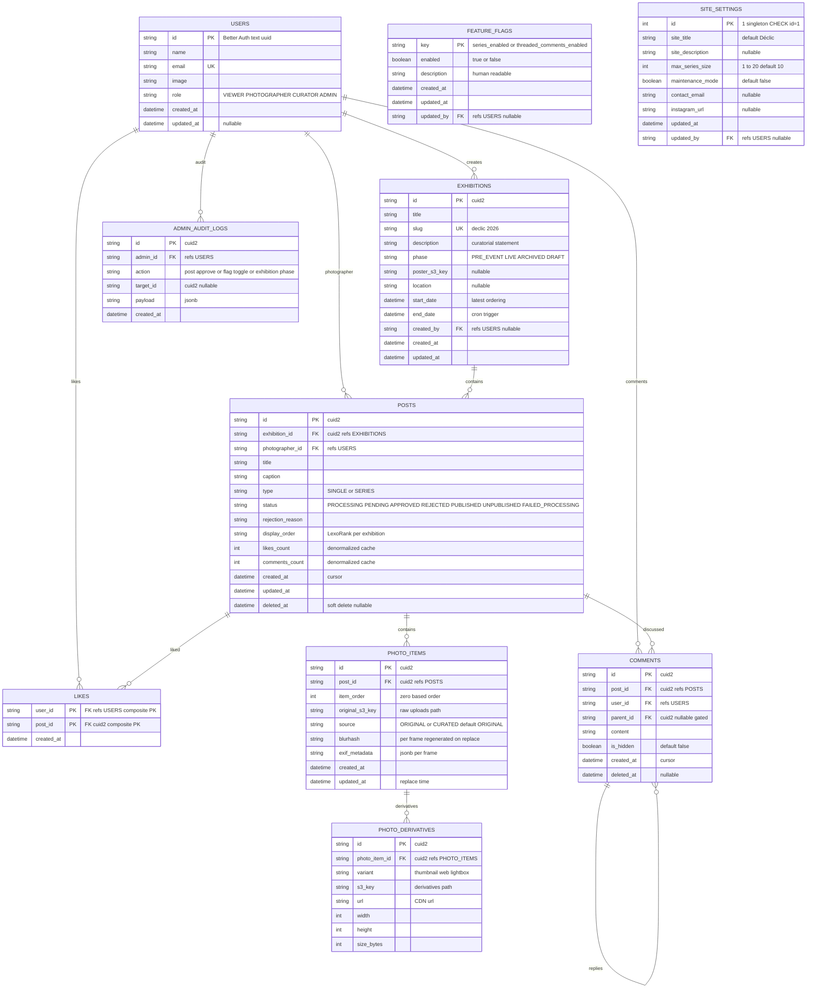

---
aliases:
  - Database Schema
tags:
  - declic
  - schema
  - database
status: draft
updated: 2026-09-01
---
# DB Schema — Déclic

**Version:** 0.4-draft (2026-09-01)
**App Version:** 0.x pre-release — `1.0.0` at first exhibition launch (PRD draft version is independent of app semver)
**Source of truth:** [PRD-API](./PRD-API.md) §2 (Database Schema & Data Model)
**Last updated:** 2026-09-01

> Root `/` always shows the **latest `LIVE` exhibition** (fallback latest `ARCHIVED`; `DRAFT`/`PRE_EVENT` never public, ordered by `start_date DESC`).
> A work is a `posts` row scoped to `exhibitions.id` (`type` `SINGLE` or `SERIES`).
> Frames are `photo_items`. Likes/comments/curation attach to `posts`; derivatives/blurhash/exif are per `photo_items`.
> **IDs:** `users` stays Better Auth-managed (`uuid` or `text`); all domain tables (`exhibitions`, `posts`, `photo_items`, `photo_derivatives`, `comments`, `admin_audit_logs`, `feature_flags` and FKs) use **`text` cuid2 generated in app** (`@paralleldrive/cuid2`) except `site_settings.id=1`.
> Ordering/pagination uses `created_at` plus `display_order`, never lexicographic `id`. Feature flags live in **typed table `feature_flags` (row-per-flag, `key` PK)**, not in `system_settings`. Phase lives only in `exhibitions.phase`. `system_settings` is **deleted**.

---

## 1. ER Diagram (Mermaid)

**`feature_flags` — row-per-flag (scalable, one row per flag):**

| Key (`key` PK) | `enabled` | Notes |
|---|---|---|
| `series_enabled` | `true` | `POST /api/posts` `SERIES` → `403 FEATURE_DISABLED` when `false` |
| `threaded_comments_enabled` | `false` | `POST /api/posts/:id/comments` `parentId` → `400` when `false` |

> Add new flag via `INSERT INTO feature_flags (key, enabled) VALUES ('new_flag', false)` — **no migration**. Cache `SELECT * FROM feature_flags` → `Map`.

**`site_settings` singleton (`id=1`) — global wide limits:**

| Column | Value | Notes |
|---|---|---|
| `id` | `1` | `CHECK id=1` — only one row |
| `max_series_size` | `10` | `CHECK 1 to 20`, validates `items.length` on **new** `POST /api/posts`; **grandfathering**: existing SERIES with 10 frames remain valid when later lowered to 5 |
| `site_title` | `Déclic — Pameran UKM CLIC UNNES` | |
| `maintenance_mode` | `false` | |
| `updated_at` / `updated_by` | `now()` / `cuid or uuid` | FK `users.id` |

**Seeds — see `docs/seed.ts` (source of truth):**

> Seeds are in `docs/seed.ts` (`featureFlagsSeed`, `siteSettingsSeed`, `exhibitionsSeed`) — `ON CONFLICT DO NOTHING` idempotent. Summary table above is the spec; do not duplicate `INSERT` SQL here. Run `bun docs/seed.ts`.

> `system_settings` **deleted**. No `event_phase` row — phase lives only in `exhibitions.phase`. Flags are in **typed table `feature_flags`**, not `jsonb` KV. `GET /api/feature-flags` (public, `Cache-Control: public, max-age=10, stale-while-revalidate=60`) + `PATCH /api/admin/feature-flags/:key` (admin) replace `GET/PATCH /api/system/settings` (legacy deleted).

**Caching — no DB hit per page open:**

> Both tables are tiny (`feature_flags` 3 rows, `site_settings` 1 row). API caches **in-memory 10s TTL** per instance (`Map` from `SELECT *`) and invalidates on `PATCH`. Public `GET` is **CDN-cacheable** (`max-age=10, stale-while-revalidate=60`) and frontend caches via `TanStack Query` `staleTime: 10_000`. No DB query per page view — only every 10s per instance + on toggle.

**Indexes and constraints:**

- `exhibitions`: `slug` UNIQUE, `phase`, `start_date DESC` (latest query), `end_date` (cron).
- `posts`: `exhibition_id`, composite `(exhibition_id, status)` for gallery, `display_order` per exhibition, `photographer_id`, `created_at`, `type`; filter `deleted_at IS NULL`; **do not** order by `id`.
- `photo_items`: `UNIQUE(post_id, item_order)`, index `post_id` and `source`; `SINGLE` has 1 row (`item_order=0`), `SERIES` 2 to `max_series_size` (read from `site_settings.max_series_size`, **grandfathering** old rows); `source` tracks `ORIGINAL` vs `CURATED` replacement (original file kept in `raw-uploads/`, old key in audit).
- `feature_flags`: `key` PK; no extra index.
- `site_settings`: `id=1` CHECK; single row.
- `likes`: composite PK `(user_id, post_id)`; transaction keeps `posts.likes_count` in sync; **frozen** when parent `exhibitions.phase='ARCHIVED'`.
- `comments`: `post_id` index; `parent_id` gated by `feature_flags.threaded_comments_enabled`; frozen when `ARCHIVED`.
- `photo_derivatives`: `photo_item_id` index; `poster_s3_key` in `exhibitions` is single image under `posters/` (dedicated ADMIN presign, no derivatives, no worker).
- All cuid2 ids: `text` PK, no `DEFAULT gen_random_uuid()` — generated in app via `createId()`.

**Better Auth tables (not visualized):** `sessions`, `accounts`, `verification` (`uuid` or `text`, unchanged).

- **Singletons:** `feature_flags` = 3 rows (`series_enabled`, `threaded_comments_enabled`, `comments_enabled`), cache `SELECT *` 10s TTL; `site_settings` = 1 row (`id=1`, `max_series_size` etc.).

**History:** v1.0 `photos uuid` flat → v1.1 `posts uuid plus photo_items` → v1.2 cuid2 + `feature_flags` KV → v1.3 `exhibitions` → v1.4 row-per-flag `feature_flags` + `site_settings` singleton + `system_settings` deleted (phase only in `exhibitions`).

---

## 2. Notes on Accepted Decisions

- **Multi-exhibition:** `exhibitions` is the top-level container (`slug`, `phase`, `start_date`, `end_date`, `location`, `poster`). Root `/` = latest `LIVE` `exhibitions` by `start_date DESC` (fallback latest `ARCHIVED` when no `LIVE`; `DRAFT`/`PRE_EVENT` never public); older at `/archive` and `/exhibition/[slug]`. `posts.exhibition_id` FK, `NOT NULL`.
- **Phase lifecycle per exhibition:** `PRE_EVENT` to `LIVE` to `ARCHIVED` via BullMQ `exhibition-scheduler` (hourly) when `end_date <= now()`. `system_settings` deleted — phase lives only in `exhibitions.phase`.
- **ARCHIVED freeze:** Gallery stays visible (permanent archive), but `POST /api/posts/upload-url` + `POST /api/posts` + `POST /api/posts/:id/like` + `POST /api/posts/:id/comments` → `403 {code:"ARCHIVED"}` (read-only; `DELETE /api/posts/:id/like` stays `204`). Curation reorder + `photo_item.replace` blocked for that exhibition.
- **SERIES:** 2 to N frames as one curatorial unit; work-level likes/comments/curation; worker enqueues one job per `photo_item` and promotes `posts.status` to `PENDING` when all frames succeed.
- **Curator replace (Option C, non-destructive):** admin may `POST /api/admin/posts/:postId/frames/:itemId/replace` with new `s3Key` → `photo_items.source` `ORIGINAL` to `CURATED`, old `s3_key` kept in `admin_audit_logs` payload, derivatives regenerated via same worker pipeline; blocked when exhibition `ARCHIVED` or frame mid-processing (`FRAME_PROCESSING`); stack-of-single-levels revert via `POST /api/admin/posts/:postId/frames/:itemId/revert` (IN for 1.0, `postId` ↔ `itemId` validated).
- **Denormalized counters** on `posts` retained as cache for `GET /api/posts` under 50ms.
- **FKs:** `likes.post_id` and `comments.post_id` on works; `photo_derivatives.photo_item_id` per frame.
- **Threading reserved:** `comments.parent_id` exists but `threaded_comments_enabled=false` in v1 so UI is flat.
- **Audit log:** `admin_audit_logs` logs `exhibition.phase_change`, `photo_item.replace` (with `old_s3_key`), `photo_item.revert`, `post.withdraw`, `post.moderate`, `comment.hide`, `feature_flag.toggle`, `site_settings.update`, `user.role_change`. Read via `GET /api/admin/audit-logs` (defined in [curation-moderation](./features/curation-moderation.md) §5; pointer at [PRD-API](./PRD-API.md) §4.7).
- **Soft delete (withdraw):** `posts.deleted_at` is the withdraw mechanism (`DELETE /api/posts/:id`, allowed in `PENDING`/`REJECTED`); `comments.deleted_at` reserved. Public gallery filters `deleted_at IS NULL`. No new tables for withdraw.
- **DRAFT phase:** `exhibitions.phase='DRAFT'` is invisible-to-public (excluded by default from `GET /api/exhibitions` and all public gallery queries; ADMIN bypass via `?phase=DRAFT`).
- **IDs:** `users` untouched (Better Auth); domain tables `text` cuid2 app-generated, cursor pagination via `created_at` plus `id` opaque, never raw cuid2 sort.
- **Feature flags:** `feature_flags` row-per-flag (`key PK`, `enabled bool`) — scalable, add flag via `INSERT` without migration; kill-switches for `series_enabled`, `threaded_comments_enabled`, and `comments_enabled`.
- **Site settings:** `site_settings` singleton `id=1` holds `max_series_size` (global limit, `CHECK 1..20`, grandfathering), `site_title`, `maintenance_mode`; seed `id=1`.
- **Grandfathering:** `max_series_size` lowered from 10 to 5 does **not** invalidate existing SERIES with 10 frames — only new `POST /api/posts` validated against current value.

---

## 3. Cross References

- [PRD-API](./PRD-API.md) §2 — textual schema spec (authoritative), §2.2 `exhibitions`, §2.9 flags/settings; endpoints live in `features/` ([exhibition-lifecycle](./features/exhibition-lifecycle.md) for exhibitions + scheduler).
- [PRD](./PRD.md) §1, §3, §4, §6, §8.4 — latest at root, per-exhibition lifecycle, ARCHIVED freeze, cron.
- [PRD-FE](./PRD-FE.md) §2 to §3, §6 — latest vs archive routes, exhibition-gated upload and frozen notice.
- [PRD-Worker](./PRD-Worker.md) §1 to §4 — per-frame processing, post aggregation, flag-aware ingestion, scheduler note.
