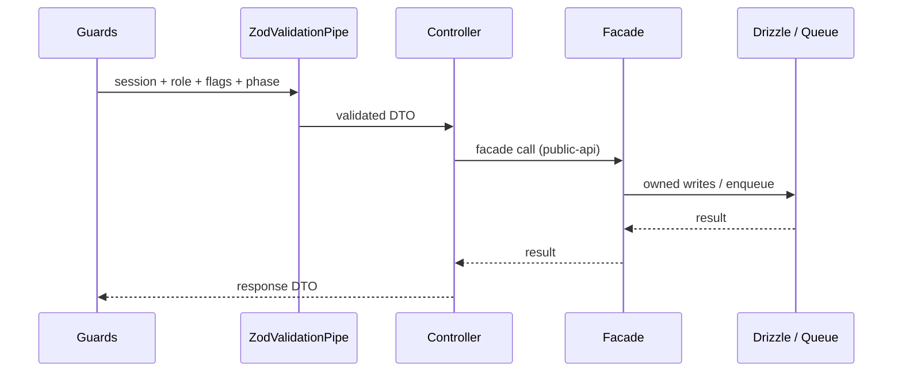
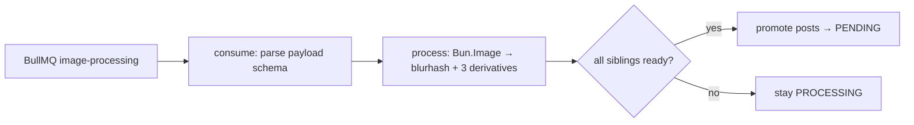

---
aliases:
  - Backend Guide
tags:
  - declic
  - backend
status: draft
updated: 2026-09-09
---

# Backend Guide (`apps/api`, NestJS on Bun)

**Status:** Draft (for owner review)
**Related:** [PRD-API](../specs/PRD-API.md) (full spec), [ADR-005](../adr/ADR-005-modular-monolith.md) (boundaries + contracts §7), [contracts](../specs/contracts.md) (shared shapes)

How the api app is built: module anatomy, request lifecycle, data
access, testing. *What* to build lives in [PRD-API](../specs/PRD-API.md) and
`features/`; *rules* live in [ADR-005](../adr/ADR-005-modular-monolith.md).
This file is *how it is organized*.

---

## 1. Module anatomy (`apps/api/src/modules/<name>/`)

```text
modules/<name>/
├── <name>.module.ts      # imports provider modules, exports the facade
├── public-api.ts         # THE barrel: facade class + types, nothing else
├── <name>.controller.ts  # HTTP only: DTO in, facade call, DTO out
├── <name>.service.ts     # facade implementation (owns the use cases)
├── dto.ts                # one-line createZodDto wrappers over contracts
└── <name>.test.ts        # unit + describe('contract') block (§5)
```

Rules: controllers never touch Drizzle or other modules' internals —
facade call only; DTOs wrap `@declic/contracts` schemas (never
hand-written `@ApiProperty`); cross-module imports only via
`public-api.ts` (gate-enforced). Living template:
`modules/examples/` (deleted when the first real module lands).

> Current state (scaffold, delete this note when `posts` lands): only
> `modules/examples/` exists — the 12 modules in [PRD-API](../specs/PRD-API.md)
> §1.1 are planned, none implemented. Landing order §6.

## 2. Request lifecycle (api)

`Better Auth session → Guards (Session/Roles/FeatureFlag/Phase) →
ZodValidationPipe → controller → facade → Drizzle and/or queue →
response DTO`. Guards read shared state (flags, phase, role) but never
business tables; cross-field rules live in services, not schemas
(see [ADR-003](../adr/ADR-003-zod-dto-strategy.md) §4).



## 3. Worker lifecycle (`apps/worker`, separate app)

Consume (`parse` payload with `imageProcessingJobSchema`) → process
(`Bun.Image`: blurhash + 3 derivatives) → aggregate (promote
`posts.status` to `PENDING` when all siblings ready, skip
`deleted_at IS NOT NULL`). No HTTP, no api imports — shared DB via
`packages/db` plus the queue payload only (see
[PRD-Worker](../specs/PRD-Worker.md) §1–§3).



## 4. Data access + queue + scheduler

- **Drizzle** (`packages/db`, landing): schema is shared-readable;
  **writes** follow the ownership map ([ADR-005](../adr/ADR-005-modular-monolith.md)
  Rule 2). Mutations on `posts` carry `WHERE deleted_at IS NULL`
  (withdraw wins races).
- **Queue**: produce via the `queue` facade (`enqueueImageJob`,
  canonical payload [contracts](../specs/contracts.md) §3); cancel via
  `cancelJobsForPost` (best-effort).
- **Scheduler** (`exhibition-scheduler`, hourly `0 * * * *`): lives in
  the `exhibitions` module, registers through `queue` infra, acts
  through the `archiveOverdue()` facade — never direct `db.update`.
- **Events**: emit `AuditRequestedEvent` (fire-and-forget, best-effort);
  never fail the request for audit. Action names from
  [contracts](../specs/contracts.md) §6.

## 5. Testing

- Unit, co-located `*.test.ts` with a `describe('contract')` block per
  `public-api` method (inputs, outputs, documented errors).
- E2e in `apps/api/test/` (boots the app; worker pipeline traced
  `POST → queue → worker → PENDING` without importing internals).
- Coverage follows the repo ≥90% release gate; `bun run boundaries`
  guards the module graph at every layer.

## 6. Landing order

`packages/db` → `storage` + `queue` → `posts` (deletes `examples/`) →
`engagement` / `curation` / `moderation` → `exhibitions` (+poster,
scheduler) → `feature-flags` / `site-settings` / `audit`
(`auth`/`users` earliest — guards depend on them). One vertical slice
per branch; slice size from the contracts it touches, not the module.

---

## Cross references

- Full spec: [PRD-API](../specs/PRD-API.md), [`features/`](../features/README.md)
- Boundaries + layering + registry + DI: [ADR-005](../adr/ADR-005-modular-monolith.md) (§2, §7)
- DTO strategy: [ADR-003](../adr/ADR-003-zod-dto-strategy.md)
- Shared shapes: [contracts](../specs/contracts.md)
- Worker pipeline: [PRD-Worker](../specs/PRD-Worker.md)
