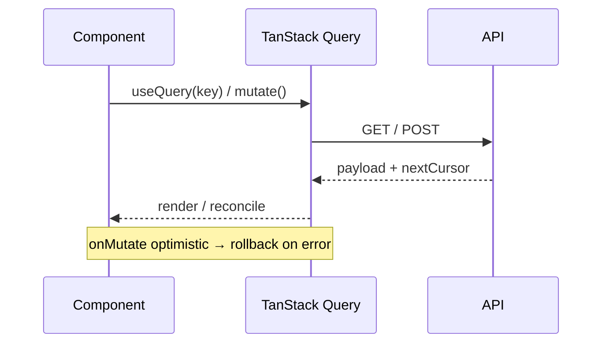
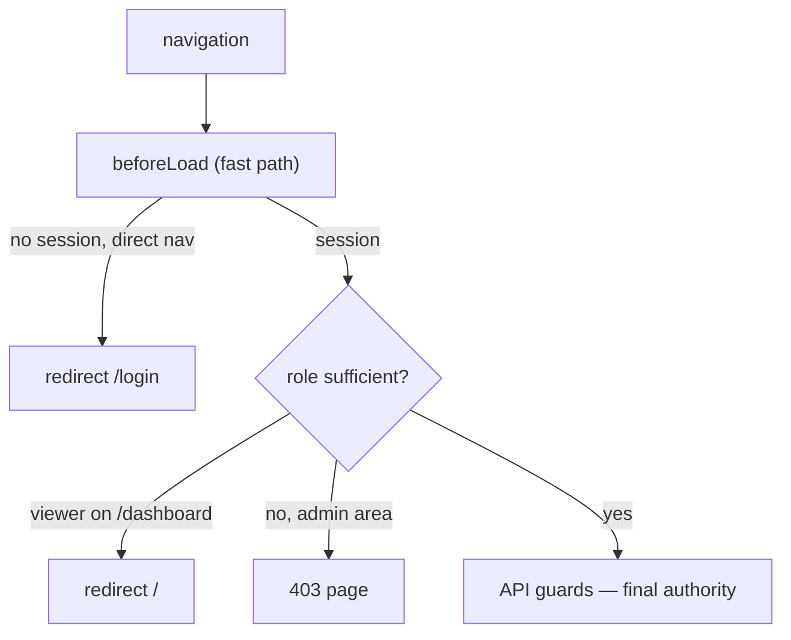

---
aliases:
  - Frontend Guide
tags:
  - declic
  - frontend
status: draft
updated: 2026-09-16
---

# Frontend Guide (`apps/web`, TanStack Start)

**Status:** Draft (for owner review)
**Related:** [DESIGN](./DESIGN.md) (design contract), [PRD-FE](../specs/PRD-FE.md) (full UI spec), [contracts](../specs/contracts.md) (shared shapes)

How the web app is built: structure, data flow, guards, env, tests.
*What* to build lives in [PRD-FE](../specs/PRD-FE.md); *how it looks* in
[DESIGN](./DESIGN.md). This file is *how it is organized*.

---

## 1. Folder structure (per route area, thin routes)

Target structure — implementation only reaches the `/` skeleton so far,
everything else grows toward this (not a snapshot of the current state):

```text
src/
├── router.tsx            # getRouter() factory + Register augmentation
├── routes/               # THIN: guard/meta + 1 feature, ≤ ~30 lines
│   ├── __root.tsx        # outer layout: html/head/body (existing)
│   ├── index.tsx         # / public gallery (existing, skeleton)
│   ├── archive.tsx       # /archive — ARCHIVED list
│   ├── exhibition.$slug.tsx  # /exhibition/$slug
│   ├── post.$postId.tsx  # /post/$postId + lightbox mask
│   ├── about.tsx         # /about
│   ├── login.tsx         # /login — Google/GitHub
│   ├── og.$postId.tsx    # /og/$postId server route (Satori)
│   ├── _authed.tsx       # PATHLESS layout: beforeLoad session wall
│   │                     # (anon → /login) + panel shell (Sidebar +
│   │                     # role-driven nav + Header) + <Outlet/>
│   ├── _authed/
│   │   ├── dashboard/
│   │   │   ├── index.tsx      # /dashboard (PHOTOGRAPHER|ADMIN, viewer → /)
│   │   │   ├── upload.tsx     # /dashboard/upload (+flag/phase guard)
│   │   │   └── edit.$postId.tsx  # /dashboard/edit/$postId (owner only)
│   │   ├── _admin.tsx    # PATHLESS layout nested inside _authed:
│   │                     # beforeLoad CURATOR|ADMIN + <Outlet/> (inherits shell)
│   │   └── _admin/
│   │       ├── moderation.tsx     # /moderation (ADMIN|CURATOR)
│   │       ├── curate.tsx         # /curate (ADMIN|CURATOR)
│   │       ├── comments.tsx       # /comments (ADMIN|CURATOR)
│   │       ├── exhibitions.tsx    # /exhibitions (ADMIN only)
│   │       ├── users.tsx          # /users (ADMIN only)
│   │       └── settings.tsx       # /settings (ADMIN only)
├── routeTree.gen.ts      # generated AND committed (typecheck needs it)
├── features/             # implementation per area; exported via barrel
│   ├── public/           # guard: public + Auth Wall for actions
│   │   ├── gallery/      # GalleryGrid, WorkCard, search/sort,
│   │   │                 # useInfiniteQuery(cursor, exhibitionId),
│   │   │                 # blurhash, ARCHIVED banner
│   │   └── work-detail/  # lightbox mask, SeriesCarousel, optimistic like,
│   │                     # comment thread, per-frame EXIF drawer, OG cover+badge
│   ├── photographer/     # guard: PHOTOGRAPHER|ADMIN
│   │   ├── work-list/    # status, Withdraw (409 WITHDRAW_CLOSED),
│   │   │                 # derived blurhash progress, rejectionReason,
│   │   │                 # exhibition dropdown
│   │   └── upload/       # dropzone SINGLE/SERIES, exifr, presigned batch,
│   │                     # FrameReorderList (item_order)
│   ├── admin/            # guard per subfolder (see routes/ above)
│   │   ├── moderation/   # queue ?exhibitionId=, approve/reject + reason
│   │   ├── curate/       # CurationCanvas dnd-kit, LexoRank reorder,
│   │   │                 # move up/down fallback (mobile)
│   │   ├── comments/     # is_hidden toggle, flat list v1
│   │   ├── exhibitions/  # CRUD + poster picker
│   │   ├── users/        # search/role/cursor table, bulk promote
│   │   └── settings/     # flag toggles + max_series_size + banner preview
│   └── shared/           # (optional) components/queries used by 3 areas —
│                         # alternative: keep in public/gallery as the
│                         # source of truth, never copy-paste
├── components/ui/        # shadcn-style copy-paste (Base UI primitives) only
├── lib/
│   ├── env.ts            # VITE_* config (existing)
│   ├── auth-client.ts    # better-auth/react client (when guards land)
│   ├── query.ts          # QueryClient, 10s staleTime (when query lands)
│   └── i18n/             # id.ts (v1), en.ts (later), t() accessor
├── styles.css            # current shadcn scaffold; final gallery tokens
│                         # follow once DESIGN §1 is implemented
└── test/ (mirrors src)   # bun test, co-located *.test.ts
```

Rules (3, easy to remember):

1. **Route file = loading + composition only** — `loader`/`beforeLoad`
   (guards), `head`/meta, then render one or two feature components.
   No business logic, no styling, no hooks beyond router-provided. If
   a route file passes ~30 lines, something leaked.
   URL-less layouts use the underscore prefix (`_authed.tsx`,
   `_authed/_admin.tsx`) — wrapper + `beforeLoad` only, no added path;
   the component renders `<Outlet/>`. Exception: `_authed.tsx` also
   owns the shared panel shell (sidebar + role nav + header), because
   every authed area uses the identical shell — pages stay thin, the
   shell lives once. Nesting rule: staff layout nests inside the
   session layout (`_authed/_admin`), never as a sibling (see
   [ADR-009](../adr/ADR-009-nested-rbac-layouts.md)). Page titles for
   the shell header come from each page's `staticData.title`, read
   via `useMatches()`.
2. **Feature = one route area** — `public/` (public + Auth Wall),
   `photographer/` (`PHOTOGRAPHER|ADMIN`), `admin/` (per subfolder:
   `ADMIN|CURATOR` or `ADMIN`-only). Components + hooks + query
   options colocated, exported via `index.ts` barrel (mirrors the
   backend `public-api.ts` pattern — one door per feature). Cross-area
   reuse (e.g. `WorkCard` in gallery + dashboard + moderation) moves
   up to `components/ui/` or `features/shared/`, never duplicated.
3. **One-way imports** — `routes → features → {ui, lib, contracts}`;
   feature-to-feature only via barrels; `ui`/`lib` never import
   features or routes.

`@/*` = `src` (see [ADR-007](../adr/ADR-007-path-aliases.md));
generated files (`routeTree.gen.ts`, `.output/`) never hand-edited.

## 2. Data flow (TanStack Query)

- Server state only via Query: `queryKey` per resource
  (`['posts', exhibitionId, sort]`, `['comments', postId]` …);
  `staleTime: 10_000` (matches API/flag TTLs); cursor pagination via
  `useInfiniteQuery` (`cursor` + `nextCursor`, never raw id sort).
- Mutations use `onMutate` optimistic update + rollback on error
  (like button, reorder, moderation actions) — reconcile with the
  returned payload (`likesCount`, echoed order).
- Type the wire with `@declic/contracts` (import type only — never
  redefine shapes; camelCase per [contracts](../specs/contracts.md) §1).
- Errors branch on `code` (never message text) → toasts per
  [DESIGN](./DESIGN.md) §6 copy table.



## 3. Guards + Auth Wall

- `beforeLoad` on layout routes (fast path) + API guards as final
  authority (UI guard never replaces API guard). Guards compose by
  nesting: `_authed` checks session, `_authed/_admin` checks staff
  role on top (never re-checks session).
- Direct navigation without session → redirect `/login` (not a
  modal — the Auth Wall modal is for in-surface actions only:
  like/comment/upload clicks, preserving file-drop, draft, pending
  like). Redirect to `/login` only for direct navigation there.
- Role gates: `/dashboard/*` → `PHOTOGRAPHER|ADMIN` (logged-in
  `VIEWER` redirects `/`); staff pages → `CURATOR|ADMIN`, with
  `exhibitions`/`users`/`settings` tightened to `ADMIN` per page;
  insufficient role in the admin area → 403 page. Roles come from
  the session union in contracts (`roleSchema`, never raw strings).



## 4. Env + config

- Vite reads root `.env` via `envDir: '../../'`; only `VITE_*` reaches
  the browser (`VITE_API_URL`, `VITE_BETTER_AUTH_URL`).
- Runtime config in `lib/env.ts` (existing) — no other file reads
  `import.meta.env` directly.

## 5. Testing

- `bun test src/` unit (components + lib, co-located `*.test.ts`);
  `bun test test/` e2e (boots Nitro build, fetches over HTTP —
  build output required first, see root `test:e2e` ordering).
- Coverage follows the repo ≥90% release gate; web e2e covers
  gallery render + one authenticated flow when auth lands.
- Frontend rules (DOM env, sandboxing, mocking boundaries, scope,
  anti-e2e limits, fetch strategy): [testing.md](./testing.md) §11.

## 6. Branching into this app (mirrors!)

`apps/web` ships to the **public** mirror (`declic-web`). The
leak-guard fails CI if `apps/web` references server secrets or
`apps/(api|worker)` paths — never import them, even in comments or
types. Mirror carries `apps/web` + `packages/*` slice + manifest only.

---

## Cross references

- Full UI spec: [PRD-FE](../specs/PRD-FE.md)
- Design contract: [DESIGN](./DESIGN.md)
- Shared shapes: [contracts](../specs/contracts.md)
- Mirror + leak-guard: [ADR-001](../adr/ADR-001-monorepo-mirror.md), `ci.yml`
